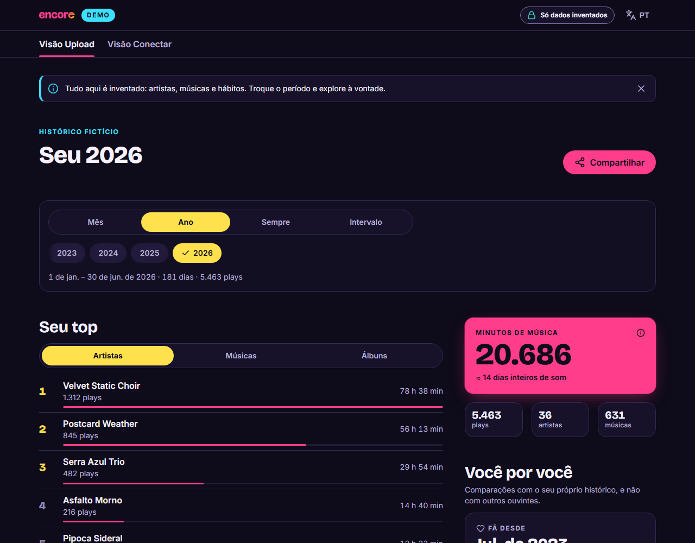
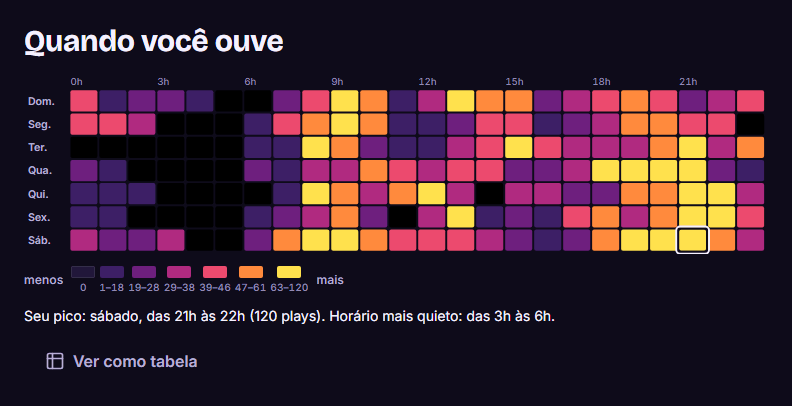
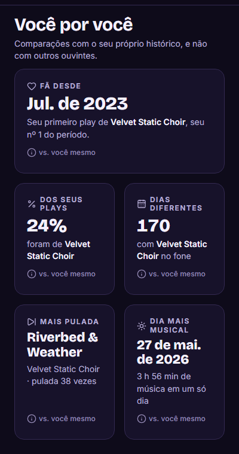
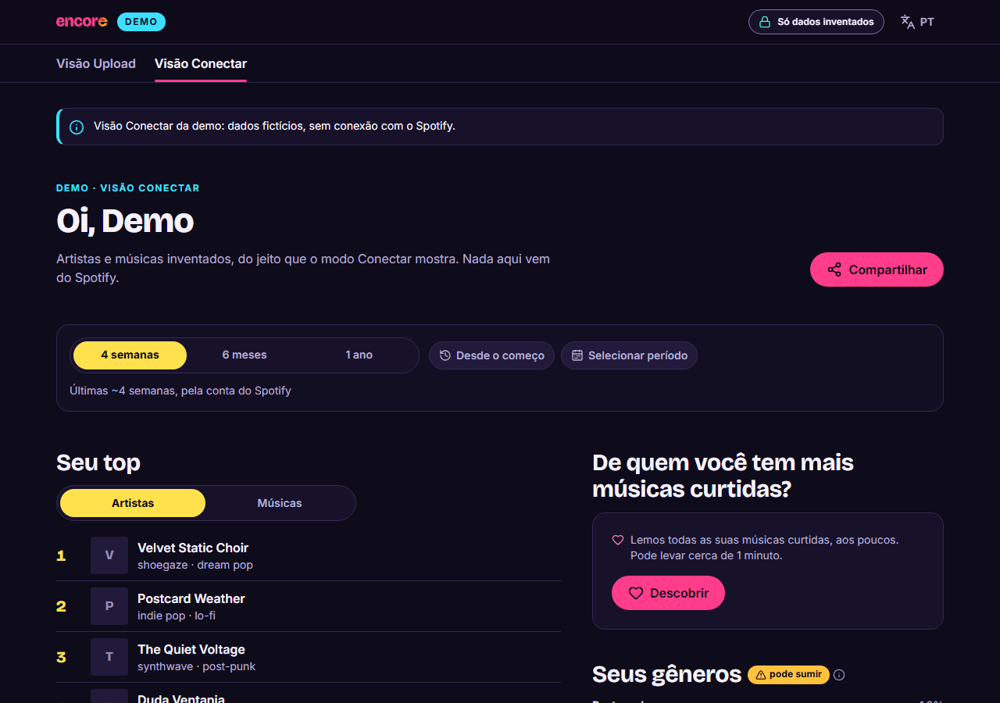
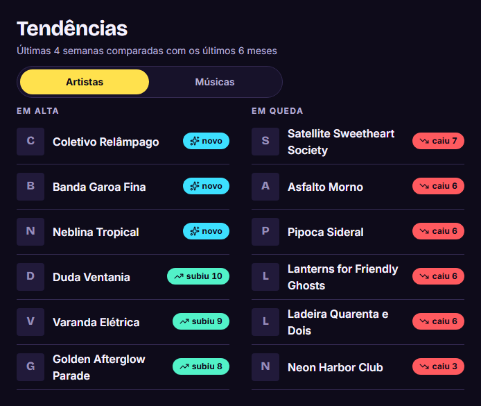
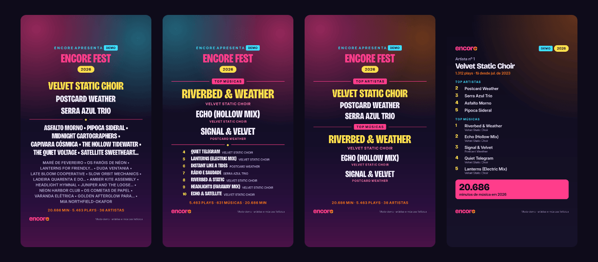
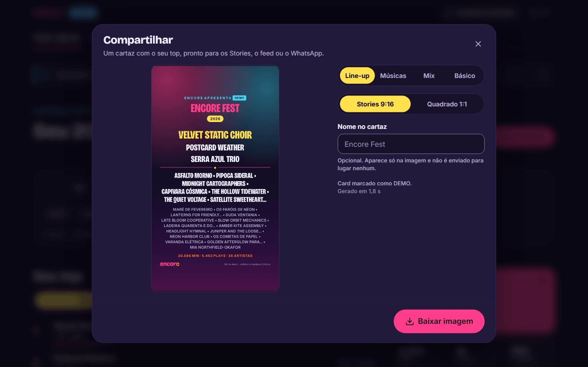
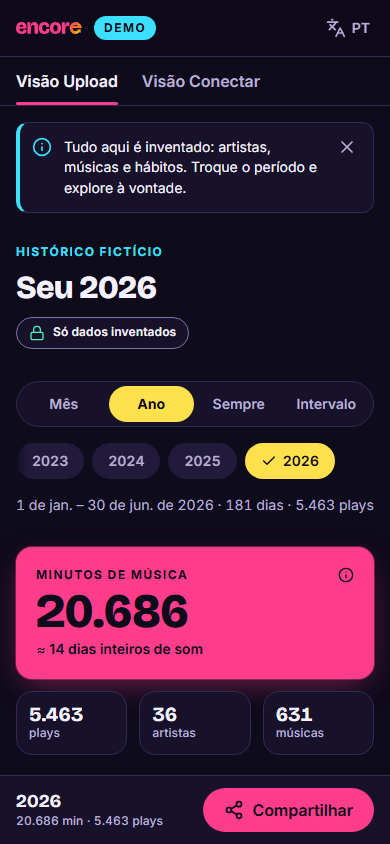

<h1 align="center">
  
</h1>

<p align="center">
  <strong>Suas estatísticas do Spotify quando você quiser: tops, horários e curiosidades de qualquer período, sem que o seu histórico saia do aparelho.</strong>
</p>

<p align="center">
  <a href="https://encore-stats.vercel.app"><strong>encore-stats.vercel.app</strong></a>
  ·
  <a href="https://encore-stats.vercel.app/pt-BR/demo">ver a demo</a>
</p>


## Como é

Todas as imagens abaixo são da **demo**, com artistas e músicas inventados.

### Seu top, seus números e o seu período

Escolha um mês, um ano, desde sempre ou um intervalo. O Encore mostra os artistas, as músicas e os
álbuns que você mais ouviu, quanto tempo de música foi e quantos artistas diferentes apareceram.



<table>
  <tr>
    <td width="60%" valign="top">
      
      <p><strong>Quando você ouve:</strong> os horários e os dias da semana em que a música toca mais.</p>
    </td>
    <td width="40%" valign="top">
      
      <p><strong>Você por você:</strong> comparações com o seu próprio histórico, e não com outras pessoas.</p>
    </td>
  </tr>
</table>

### Modo Conectar: o que está tocando agora

Entrando com a conta do Spotify, você vê os tops das últimas 4 semanas, dos últimos 6 meses e do
último ano, quem subiu e quem caiu, e de quem você tem mais músicas curtidas.

<table>
  <tr>
    <td width="62%" valign="top">
      
    </td>
    <td width="38%" valign="top">
      
    </td>
  </tr>
</table>

### Cartazes para compartilhar

Quatro modelos, **Line-up**, **Músicas**, **Mix** e **Básico**, em Stories (9:16) ou quadrado
(1:1). A imagem é feita no seu aparelho, com o período que está na tela, e vai direto para os
Stories, o feed ou o WhatsApp.





### No celular

<table>
  <tr>
    <td width="33%"></td>
    <td width="33%"></td>
    <td width="33%"></td>
  </tr>
</table>

## Três jeitos de usar

- **Enviar o histórico (modo Upload).** Você pede ao Spotify o arquivo com o seu histórico
  completo (ele chega por e-mail em alguns dias) e escolhe esse arquivo aqui. A conta toda é feita
  no seu aparelho, e dá para ver qualquer período, desde a primeira música. É o modo aberto a
  todo mundo.
- **Conectar com o Spotify (modo Conectar).** Você entra com a sua conta e vê na hora os tops dos
  últimos meses. Ainda está em fase de testes no Spotify: por enquanto, só funciona para contas
  convidadas.
- **Demo.** Tudo inventado, para conhecer o Encore sem enviar nada e sem entrar com conta.

## Privacidade, sem letra miúda

- Seu arquivo é lido aqui, no seu aparelho, e não é enviado para lugar nenhum.
- Sem cadastro, sem rastreamento e sem guardar as suas músicas com a gente.
- No modo Conectar, a sua conexão com o Spotify fica salva neste navegador, trancada de um jeito
  que só o Encore abre. O que vem da sua conta fica só nesta aba.
- Os cartazes também são feitos no aparelho. O "Nome no cartaz" só aparece na imagem.
- Os detalhes estão na [política de privacidade](https://encore-stats.vercel.app/pt-BR/privacy).

O Encore não é afiliado ao Spotify.

## Para quem desenvolve

Stack: Next.js 16 (App Router, Turbopack) · React 19 · TypeScript 6 (`strict`) · Tailwind CSS 4 ·
next-intl (PT-BR e EN) · Zod 4 · Vitest 5 · Playwright + axe. Deploy na Vercel. Sem banco.
O plano completo está em [`docs/projeto/`](docs/projeto/).

> Estado: MVP completo (Sprints 0–7: upload, demo, Conectar, cards e auditoria de segurança) e no
> ar em modo Upload + Demo. A Iteração 8b trouxe os cartazes Músicas e Mix, a logo nova e os textos
> em linguagem do dia a dia; a Sprint 8 segue com a validação e o Conectar em produção (veja
> `docs/projeto/PROGRESSO.md`). Contrato do BFF: [`docs/api.md`](docs/api.md).

Por baixo, os três modos funcionam assim:

- **Upload:** o `.zip` do "Histórico de streaming estendido" é processado num Web Worker, no
  navegador, sem nenhuma requisição com o conteúdo.
- **Conectar:** login OAuth no Spotify (até 5 contas na allowlist do Development Mode); um BFF
  mínimo e sem estado guarda os tokens só num cookie JWE `HttpOnly`.
- **Demo:** dados fictícios e determinísticos, sem rede e sem login.

## Pré-requisitos

| Ferramenta | Versão                         | Observação                                                                         |
| ---------- | ------------------------------ | ---------------------------------------------------------------------------------- |
| Node.js    | **24.x** (`.nvmrc`, `engines`) | O CI e a Vercel usam Node 24; com outra major o pnpm avisa (`Unsupported engine`). |
| pnpm       | **10.34.5** (`packageManager`) | Via Corepack (abaixo). A Vercel ainda não suporta pnpm 11+.                        |

O jeito mais simples de ter a versão certa do pnpm é o Corepack, que vem com o Node 24 e lê o
campo `packageManager` do `package.json`:

```bash
corepack enable        # uma vez por máquina; depois, `pnpm` já roda a 10.34.5 neste projeto
pnpm --version         # 10.34.5
```

Sem Corepack: `npm install -g pnpm@10.34.5`.

## Como rodar localmente

```bash
git clone <url-do-repositório> encore && cd encore
pnpm install
cp .env.example .env.local   # pode ficar vazio: Upload e Demo funcionam sem credenciais
pnpm dev                     # http://127.0.0.1:3000 (redireciona para /pt-BR ou /en)
```

Use **`http://127.0.0.1:3000`**, não `localhost`: o Spotify só aceita redirect URI de loopback
com IP literal, e o cookie de sessão depende da mesma origem.

O "seed" local é o **modo Demo** (gerador determinístico, sem banco e sem rede). Não há
credenciais de demonstração: o Demo não exige login.

### Telas do frontend

| Rota                   | O quê                                                                                 |
| ---------------------- | ------------------------------------------------------------------------------------- |
| `/{locale}`            | Landing: os 3 modos (Conectar desabilitado sem credenciais), selo de privacidade      |
| `/{locale}/onboarding` | Como pedir o histórico estendido ao Spotify + lembrete `.ics` gerado no navegador     |
| `/{locale}/upload`     | Envio do `.zip`/`.json` (Web Worker, nada sai do aparelho) e dashboard do histórico   |
| `/{locale}/demo`       | Dashboard com histórico fictício, com as abas "Visão Upload" e "Visão Conectar"       |
| `/{locale}/privacy`    | Política de privacidade (LGPD): o que é tratado, onde, por quanto tempo, como revogar |
| `/{locale}/connect`    | Modo Conectar: entrada/login, erros do OAuth e dashboard ao vivo (tops, tendências…)  |

O botão **Compartilhar** (Upload, Demo e Conectar) abre o modal de cards: Line-up, Músicas, Mix
ou Básico, Stories 9:16 ou Quadrado 1:1, com o período/janela selecionado no dashboard (Músicas e
Mix ficam desabilitados quando o período não tem músicas). A imagem (PNG) é gerada no
navegador (Web Worker com satori + resvg-wasm, carregados só nesse toque) e compartilhado pela Web
Share API quando o navegador aceita arquivos; senão, é baixado.

`{locale}` é `pt-BR` ou `en`; o idioma troca pelo menu do cabeçalho sem perder o histórico
carregado (o Dataset fica só na memória da aba; recarregar a página exige novo envio).

Para testar o upload sem o seu histórico real, use as fixtures sintéticas de `tests/fixtures/`
(`valid-two-files.zip`, ou os maliciosos `zip-bomb.zip` e `path-traversal.zip`).

Para rodar os testes E2E pela primeira vez, instale os navegadores do Playwright (Chromium e
WebKit, este último para aproximar o Safari/iOS):

```bash
pnpm exec playwright install chromium webkit
```

## Scripts

| Comando                             | O que faz                                                               |
| ----------------------------------- | ----------------------------------------------------------------------- |
| `pnpm dev`                          | Servidor de desenvolvimento em `127.0.0.1:3000`                         |
| `pnpm build` / `pnpm start`         | Build de produção / servidor de produção em `127.0.0.1:3000`            |
| `pnpm lint`                         | ESLint (flat config: Next + typescript-eslint), sem warnings            |
| `pnpm format` / `pnpm format:check` | Prettier (com ordenação de classes do Tailwind)                         |
| `pnpm typecheck`                    | Gera os tipos de rota do Next e roda `tsc --noEmit`                     |
| `pnpm test`                         | Vitest (unit/integração em Node e componentes em jsdom)                 |
| `pnpm test:coverage`                | Vitest com cobertura (meta ≥ 80% em `src/domain`)                       |
| `pnpm test:e2e`                     | Playwright (Chromium + WebKit) + axe; faz `build` + `start` se preciso  |
| `pnpm fixtures`                     | Regenera `tests/fixtures/` (zips sintéticos válidos e maliciosos)       |
| `UPDATE_CARD_SNAPSHOTS=1 pnpm test` | Regrava as referências visuais dos cards em `tests/snapshots/cards/`    |
| `pnpm bench`                        | Benchmark do upload: ~50 MB sintéticos (meta < 10 s) e troca de período |

## Variáveis de ambiente

Catálogo completo e comentado em [`.env.example`](.env.example); validação com Zod em
`src/server/env.ts` (por ambiente na Vercel: veja "Deploy na Vercel"). Resumo:

| Variável                                                             | Obrigatória          | Para quê                                                      |
| -------------------------------------------------------------------- | -------------------- | ------------------------------------------------------------- |
| `SPOTIFY_CLIENT_ID`, `SPOTIFY_CLIENT_SECRET`, `SPOTIFY_REDIRECT_URI` | Não (as três juntas) | Modo Conectar. Sem elas, o botão fica desabilitado            |
| `SESSION_SECRET`                                                     | Se houver Conectar   | 32 bytes em base64url para o cookie JWE                       |
| `SESSION_SECRET_PREVIOUS`                                            | Não                  | Rotação do segredo de sessão                                  |
| `NEXT_PUBLIC_SITE_URL`                                               | Em produção          | URL canônica (local: `http://127.0.0.1:3000`)                 |
| `NEXT_PUBLIC_REPO_URL`                                               | Não                  | Link "veja o código" do selo de privacidade (só `https://`)   |
| `NEXT_PUBLIC_PRIVACY_CONTROLLER`, `NEXT_PUBLIC_PRIVACY_CONTACT`      | Em produção          | Controlador e e-mail de contato exibidos em `/privacy` (LGPD) |
| `SPOTIFY_API_BASE`, `SPOTIFY_ACCOUNTS_BASE`                          | Não                  | Só testes: mock do Spotify em loopback (proibidas na Vercel)  |

Configuração parcial do Spotify (ex.: só o Client ID) **falha no `next build` e na
inicialização** com a lista das variáveis que faltam (o schema fica em `src/server/env-schema.ts`,
que o `next.config.ts` também chama). Nunca commite `.env.local` (já está no `.gitignore`).

Gerar um `SESSION_SECRET`:

```bash
node -e "console.log(require('crypto').randomBytes(32).toString('base64url'))"
```

## Cadastrar o app no Spotify (modo Conectar)

1. Acesse o [Spotify Developer Dashboard](https://developer.spotify.com/dashboard) com a conta
   do **dono do app**. Desde 2025, apps em _Development Mode_ exigem que o dono tenha
   **Spotify Premium**.
2. **Create app**: nome "Encore", uma descrição curta, e marque **Web API**.
3. Em **Redirect URIs**, cadastre exatamente:
   - local: `http://127.0.0.1:3000/api/auth/callback`
   - staging e produção: `https://<domínio>/api/auth/callback` (veja "Deploy na Vercel")
4. Copie o **Client ID** e o **Client Secret** para o `.env.local` (`SPOTIFY_CLIENT_ID`,
   `SPOTIFY_CLIENT_SECRET`), defina `SPOTIFY_REDIRECT_URI` com a URI local acima e gere o
   `SESSION_SECRET`.
5. Em **User Management**, adicione as contas que podem usar o Conectar: em _Development Mode_ o
   limite é de **5 usuários** (o autor + até 4), cada um com nome e e-mail da conta Spotify.
6. Reinicie o `pnpm dev`. A página inicial passa a mostrar o Conectar como disponível.

Escopos pedidos (mínimos): `user-top-read`, `user-read-recently-played`, `user-library-read`.

### Testar o login real em `http://127.0.0.1:3000`

1. Faça os passos acima (app no dashboard, redirect URI `http://127.0.0.1:3000/api/auth/callback`,
   sua conta em **User Management**) e preencha o `.env.local`:

   ```bash
   SPOTIFY_CLIENT_ID=<client id>
   SPOTIFY_CLIENT_SECRET=<client secret>
   SPOTIFY_REDIRECT_URI=http://127.0.0.1:3000/api/auth/callback
   SESSION_SECRET=<saída do comando node acima>
   ```

2. `pnpm dev` e abra **`http://127.0.0.1:3000/pt-BR/connect`** (use `127.0.0.1`, não
   `localhost`: os cookies vivem na origem da redirect URI; se abrir `localhost`, o login te leva
   para `127.0.0.1`).
3. Clique em **Entrar com o Spotify**, autorize e volte para a mesma página, que passa a mostrar
   o dashboard do Conectar ("Oi, …"): janelas de 4 semanas / 6 meses / 1 ano, top artistas e
   músicas, tendências, tocadas recentemente, gêneros e a varredura de curtidas ("Descobrir").
4. Na mesma aba, abra as rotas do BFF para ver os dados reduzidos (JSON):
   `/api/spotify/me`, `/api/spotify/top?type=artists&range=short_term`,
   `/api/spotify/top?type=tracks&range=long_term`, `/api/spotify/recent`,
   `/api/spotify/saved?offset=0`.
5. Nas DevTools (Application → Cookies) o cookie `encore_session` é `HttpOnly` e `SameSite=Lax`,
   com validade de 30 dias. Localmente ele sai **sem** `Secure` e sem o prefixo `__Host-`, porque
   o Safari descarta cookies `Secure` em HTTP e o Chrome rejeita `__Host-` fora de HTTPS; em
   produção (HTTPS) o nome é `__Host-encore_session`, com `Secure` (detalhes em `docs/api.md`).
6. No avatar do cabeçalho, **Sair** (com confirmação): o cookie some, o cache da aba
   (TanStack Query + sessionStorage) é apagado e `/api/spotify/me` passa a responder
   `401 {"error":{"code":"UNAUTHENTICATED"}}`.

Casos para conferir: cancelar no Spotify volta com "Autorização cancelada"; uma conta fora do User
Management volta com a tela "Este app ainda está em modo de teste" (`?error=not_allowlisted`),
que explica o limite de 5 contas e oferece Upload e Demo.

### Testar o fluxo sem conta do Spotify (mock local)

`scripts/spotify-mock-server.ts` simula o Accounts e a Web API com dados fictícios (confere o PKCE
e rotaciona o refresh token). Em dois terminais:

```bash
node scripts/spotify-mock-server.ts     # http://127.0.0.1:4010
```

No `.env.local` (credenciais quaisquer, porque o mock não as confere contra nada real):

```bash
SPOTIFY_CLIENT_ID=mock
SPOTIFY_CLIENT_SECRET=mock
SPOTIFY_REDIRECT_URI=http://127.0.0.1:3000/api/auth/callback
SESSION_SECRET=<32 bytes em base64url>
SPOTIFY_ACCOUNTS_BASE=http://127.0.0.1:4010
SPOTIFY_API_BASE=http://127.0.0.1:4010/v1
```

Depois `pnpm dev` (ou `pnpm build && pnpm start`) e siga os passos 2–6 acima. Apague as duas
linhas `SPOTIFY_*_BASE` para voltar ao Spotify real.

Variáveis do mock: `MOCK_SPOTIFY_DENY=1` (simula "cancelar"), `MOCK_SPOTIFY_FORBIDDEN=1` (conta
fora da allowlist), `MOCK_SPOTIFY_EXPIRES_IN=30` (força refresh a cada chamada),
`MOCK_SPOTIFY_SAVED_TOTAL=1200` (biblioteca maior) e `MOCK_SPOTIFY_SAVED_DELAY_MS=300` (atraso por
página de curtidas, para ver o progresso da varredura). As capas do mock (`i.scdn.co/image/mock…`)
não existem de verdade; o dashboard mostra a inicial no lugar.

### E2E do Conectar

O `pnpm test:e2e` sobe três servidores, em ordem (`playwright.config.ts`): o app em `:3000` sem
credenciais (faz o build), o mock do Spotify em `:4010` e o mesmo build em `:3100` com o Conectar
ligado contra o mock (`SESSION_SECRET` descartável, só de teste). `e2e/connect-live.spec.ts` faz
login → dashboard → trocar janela → varredura → logout (cache limpo), mais axe, 360 px, `QUOTA` e 401. Com o pnpm 10 via Corepack, o
`pnpm test:e2e` sobe os três sozinho também no Windows. Para depurar, dá para subi-los à mão (os
servidores já de pé são reaproveitados):

```bash
pnpm build
pnpm start                                   # :3000
node scripts/spotify-mock-server.ts          # :4010
SPOTIFY_CLIENT_ID=mock-client SPOTIFY_CLIENT_SECRET=mock-secret   SPOTIFY_REDIRECT_URI=http://127.0.0.1:3100/api/auth/callback   SESSION_SECRET=e2e-only-not-a-secret-000000000000000000000   SPOTIFY_ACCOUNTS_BASE=http://127.0.0.1:4010 SPOTIFY_API_BASE=http://127.0.0.1:4010/v1   NEXT_PUBLIC_SITE_URL=http://127.0.0.1:3100   node node_modules/next/dist/bin/next start --hostname 127.0.0.1 --port 3100
```

### Marca do Spotify

Os logos em `public/brand/` são os arquivos oficiais, sem alteração, das Spotify Design
Guidelines (developer.spotify.com/documentation/design): `Full_Logo_White_RGB.svg` do pacote
`2024-spotify-full-logo.zip` (→ `spotify-full-logo-white.svg`) e `Primary_Logo_White_RGB.svg` do
pacote `2024-spotify-logo-icon.zip` (→ `spotify-icon-white.svg`), baixados em 2026-09-24. Só
aparecem junto de dados vindos da API do Spotify (modo Conectar), nunca no Upload nem no Demo.

## Deploy na Vercel

O deploy é **sem configuração** e **sem `vercel.json`**: a Vercel detecta o Next.js, instala com o
pnpm 10 (pelo `pnpm-lock.yaml` + `packageManager`), usa o Node 24 (pelo `engines.node: 24.x`) e
roda `pnpm build`. Os cabeçalhos de segurança já vêm do `proxy.ts` (CSP com nonce) e do
`next.config.ts`; não há rewrite, redirect, cron nem região que precise de `vercel.json`.

O `next build` valida as variáveis de ambiente (`src/server/env-schema.ts`, chamado pelo
`next.config.ts`). Configuração inválida **falha o build** com a lista dos nomes que faltam ou
estão errados (nunca os valores), e o deployment anterior continua no ar.

### 1. Importar o repositório

1. Em [vercel.com/new](https://vercel.com/new), **Import Git Repository** e escolha este repositório
   (dê ao app da Vercel no GitHub acesso só a ele).
2. **Framework Preset:** Next.js (detectado). Não ligue nenhum _Override_ em Build, Install ou
   Output. **Root Directory:** a raiz.
3. **Antes do primeiro deploy**, cadastre as variáveis de produção (passo 3). Sem elas, o build de
   produção falha de propósito.
4. Depois do deploy, confira no log do build a linha do pnpm (`pnpm@10.x`) e a do Node (24.x).
   Opcional: se o pnpm do log for anterior à 10.34.5, crie a variável
   `ENABLE_EXPERIMENTAL_COREPACK=1` (todos os ambientes). Assim a Vercel usa, via Corepack,
   exatamente a versão do `packageManager`.

### 2. Ambientes

| Ambiente            | Branch         | URL                                                                     | Conectar                                 | Proteção              |
| ------------------- | -------------- | ----------------------------------------------------------------------- | ---------------------------------------- | --------------------- |
| Produção            | `main`         | `https://<projeto>.vercel.app` (ou domínio próprio)                     | Sim                                      | Pública               |
| Staging             | `staging`      | URL fixa do branch: `https://<projeto>-git-staging-<escopo>.vercel.app` | Sim (redirect URI cadastrada no Spotify) | Deployment Protection |
| Previews (PRs etc.) | qualquer outro | dinâmica, uma por deployment                                            | **Não** (sem variáveis do Spotify)       | Deployment Protection |

1. Crie o branch: `git switch -c staging && git push -u origin staging`. A URL fixa aparece em
   **Deployments** → deployment do `staging` → **Domains** (a que tem `-git-staging-`). Para uma
   URL mais curta, em **Settings → Domains** adicione um domínio e ligue-o ao branch `staging`.
2. **Settings → Deployment Protection → Vercel Authentication:** ligada, em _Standard Protection_
   (protege todos os previews, inclusive o `staging`, e deixa o domínio de produção público).
   Quem abre o `staging` precisa entrar com uma conta Vercel com acesso ao projeto (no Hobby, só
   1 usuário externo) ou usar um _Shareable Link_ do deployment.
3. **Settings → Git:** confira que o _Production Branch_ é `main`. Proteja o `main` no GitHub
   exigindo os jobs do CI (veja `docs/projeto/relatorio-seguranca.md`, seção 9).

### 3. Variáveis de ambiente

Em **Settings → Environment Variables**. Para o `staging`, escolha _Preview_ e, em "Select a
custom Preview branch", o branch `staging`: variáveis de um branch sobrescrevem as de _Preview_
geral. **Não** crie as variáveis do Spotify em _Preview_ geral: é a ausência delas que desliga o
Conectar nos previews dinâmicos (a redirect URI deles não está cadastrada no Spotify).

| Variável                                    | Produção                                 | Preview do `staging`                  | Previews dinâmicos | Observação                                          |
| ------------------------------------------- | ---------------------------------------- | ------------------------------------- | ------------------ | --------------------------------------------------- |
| `NEXT_PUBLIC_SITE_URL`                      | **Obrigatória**: `https://<produção>`    | Recomendada: `https://<staging>`      | Deixe vazia        | Só HTTPS em deploys                                 |
| `NEXT_PUBLIC_PRIVACY_CONTROLLER`            | **Obrigatória**: `Enzo Terra`            | Recomendada: `Enzo Terra`             | Opcional           | Nome do controlador, exibido em `/privacy`          |
| `NEXT_PUBLIC_PRIVACY_CONTACT`               | **Obrigatória**: `enzoterra18@gmail.com` | Recomendada: `enzoterra18@gmail.com`  | Opcional           | E-mail de contato do titular, exibido em `/privacy` |
| `SPOTIFY_CLIENT_ID`                         | Sim                                      | Sim (o mesmo app)                     | **Não**            | As três do Spotify vão juntas, ou nenhuma           |
| `SPOTIFY_CLIENT_SECRET`                     | Sim, _Sensitive_                         | Sim, _Sensitive_                      | **Não**            | Só no servidor                                      |
| `SPOTIFY_REDIRECT_URI`                      | `https://<produção>/api/auth/callback`   | `https://<staging>/api/auth/callback` | **Não**            | Idêntica à cadastrada no Spotify                    |
| `SESSION_SECRET`                            | Sim, _Sensitive_, **só de produção**     | Sim, _Sensitive_, **outro valor**     | **Não**            | Obrigatória quando o Conectar está configurado      |
| `SESSION_SECRET_PREVIOUS`                   | Só durante uma rotação                   | Só durante uma rotação                | Não                | O segredo anterior, para não derrubar sessões       |
| `NEXT_PUBLIC_REPO_URL`                      | Opcional                                 | Opcional                              | Opcional           | Só `https://`                                       |
| `SPOTIFY_API_BASE`, `SPOTIFY_ACCOUNTS_BASE` | **Nunca**                                | **Nunca**                             | **Nunca**          | Só mocks locais; o build de deploy falha com elas   |

`VERCEL_ENV` é definida pela própria Vercel (`production` ou `preview`) e liga as regras de deploy
do `env.ts`: HTTPS obrigatório, mocks proibidos, segredo dos e2e recusado e, em produção, as três
primeiras linhas da tabela obrigatórias.

Os valores de privacidade acima foram informados pelo cliente em 2026-09-25 e existem **só no
painel da Vercel**: o código e o `.env.example` não têm valor padrão para eles.

Gere um `SESSION_SECRET` **por ambiente** (rode o comando duas vezes, cole direto no painel e não
guarde a saída em outro lugar):

```bash
node -e "console.log(require('crypto').randomBytes(32).toString('base64url'))"
```

Rotação: copie o valor atual para `SESSION_SECRET_PREVIOUS`, gere um novo `SESSION_SECRET` e faça
Redeploy. Apague o `SESSION_SECRET_PREVIOUS` depois de 30 dias (a validade máxima da sessão).

Mudou alguma variável? Ela só vale para deployments novos: use **Redeploy** no último deployment.
As `NEXT_PUBLIC_*` entram no JavaScript no build, então também só mudam com um novo build.

### 4. Spotify Developer Dashboard

1. No app "Encore", **Edit Settings → Redirect URIs**, deixe exatamente:
   - `https://<produção>/api/auth/callback`
   - `https://<staging>/api/auth/callback` (a URL fixa do branch, nunca a de um deployment)
   - `http://127.0.0.1:3000/api/auth/callback` (desenvolvimento local)
2. **User Management:** até 5 contas (o dono + 4), com nome e e-mail da conta Spotify de cada uma.
3. **A conta dona do app precisa ter Spotify Premium.** Desde fevereiro de 2026, sem Premium o
   Spotify para o app em _Development Mode_ e todo login volta 403, que o Encore mostra como a
   tela "Este app ainda está em modo de teste" (ela cita essa causa).

### 5. Conferir o deploy

```bash
curl -s https://<produção>/api/health                 # {"status":"ok"}
curl -sI https://<produção>/pt-BR                     # CSP com nonce, HSTS, nosniff, COOP...
curl -sI https://<produção>/api/spotify/me            # 401, default-src 'none', CORP same-origin
curl -s -o /dev/null -w "%{http_code}\n" https://<produção>/pt-BR/nao-existe   # 404
```

Depois, no navegador: `/pt-BR/privacy` mostra o controlador e o contato, e o Conectar faz login e
logout com uma conta da allowlist (em produção e no `staging`).

### 6. Rollback

Deploys da Vercel são imutáveis e não há banco nem migração, então voltar é instantâneo:

1. Na visão geral do projeto, no quadro do deployment de produção, clique em **Instant Rollback**
   (ou, em **Deployments**, ⋮ → **Instant Rollback**). No Hobby, só dá para voltar ao deployment
   de produção imediatamente anterior.
2. O deployment volta com as variáveis de ambiente **que ele tinha**: mudanças posteriores no
   painel não se aplicam a ele.
3. Depois de um rollback, a Vercel **para de publicar** os pushes em `main` sozinha. Corrigido o
   problema, use **Undo Rollback** (ou promova um deployment novo) para reativar a publicação
   automática.

Antes de cada go-live, anote qual é o deployment de produção atual (o alvo do rollback).

## Estrutura

```
app/[locale]/        páginas (RSC) em /pt-BR e /en
app/api/             BFF (auth e proxy do Spotify) + /api/health
proxy.ts             nonce de CSP, cabeçalhos de segurança e negociação de idioma
src/domain/          lógica pura (histórico, Dataset, stats, demo), testável em Node
src/server/          env validado, cabeçalhos de segurança, sessão JWE, cliente Spotify, logger
src/components/      layout (cabeçalho, rodapé, selo), UI base e a logo (`brand/`)
src/features/        UI por área
src/workers/         Web Workers (processamento do upload e geração dos cards), sem rede
src/i18n/            rotas e mensagens do next-intl
e2e/                 testes Playwright + axe
scripts/             fixtures (`pnpm fixtures`) e mock local do Spotify
tests/               setup, stubs, fixtures, mocks do Spotify e benchmark (`tests/perf`)
docs/api.md          contrato do BFF (rotas, parâmetros, erros, TTLs, OAuth)
docs/readme/         logo e screenshots deste README (demo, dados fictícios)
```

Alias de import: `@/…` aponta para `src/…`.

## Segurança e CI

- Cabeçalhos em toda resposta (HSTS, `nosniff`, `Referrer-Policy: no-referrer`,
  `Permissions-Policy`, COOP) e, nas páginas, CSP com nonce por requisição (`strict-dynamic`,
  `frame-ancestors 'none'`).
  Confira com `curl -I http://127.0.0.1:3000/pt-BR`.
- `'wasm-unsafe-eval'` só na CSP dos scripts de Web Worker (`/_next/static`, via `next.config.ts`),
  com `connect-src data:`: o WASM dos cards roda no worker e nenhum worker faz requisição. As
  páginas não liberam WASM; o `connect-src` delas é `'self'` + `https://i.scdn.co` (capa do card
  do Conectar, ADR 9).
- GitHub Actions (`.github/workflows/ci.yml`), com `permissions: contents: read` e actions
  fixadas por SHA: lint + formatação, tipos, testes com cobertura, build, e2e + axe (Chromium e
  WebKit; Conectar contra o mock local), `pnpm audit --audit-level=high` e dependency-review nos
  PRs.
- Dependabot semanal e agrupado (npm e GitHub Actions), com espera de 3 dias.
- pnpm: scripts de install bloqueados (`allowBuilds`) e `minimumReleaseAge` de 1 dia em
  `pnpm-workspace.yaml`.
