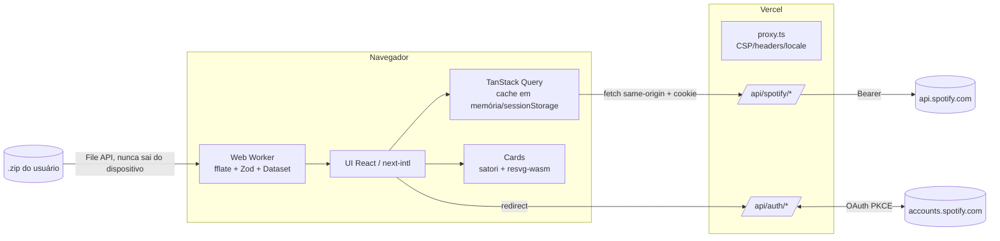

# 03 — Arquitetura

## Estilo
**Monólito Next.js serverless (App Router) na Vercel, com cliente rico.**
- **Tudo roda no navegador:** o modo Upload e o modo Demo, por decisão de privacidade.
- **Servidor = BFF mínimo e sem estado.** Cuida do OAuth, da sessão selada em cookie e de um proxy fino para a API do Spotify, que reduz as respostas ao mínimo necessário.
- **Sem banco, sem fila, sem cache de servidor.**

## Componentes
| Componente | Onde roda | Responsabilidade |
|---|---|---|
| `app/[locale]/…` (páginas) | Servidor (RSC) + cliente | Landing, onboarding, privacidade, dashboards, cards |
| `proxy.ts` | Edge/Node (Next 16) | Nonce de CSP, cabeçalhos de segurança, negociação de locale |
| `app/api/auth/{login,callback,logout}` | Servidor | OAuth Authorization Code + PKCE + `state`; grava e apaga o cookie JWE |
| `app/api/spotify/*` | Servidor | Proxy tipado para `/me`, `/me/top/{artists,tracks}`, `/me/player/recently-played`, `/me/tracks` (uma página por chamada) e `/artists/{id}` (sob demanda). Faz refresh transparente, trata 429/`QUOTA_EXCEEDED`/`invalid_grant`, reduz a resposta e aplica `Cache-Control: private` |
| `src/server/session.ts` | Servidor | Selar/abrir o cookie JWE (`jose`, `dir` + `A256GCM`, `kid` para rotação) |
| `src/server/spotify-client.ts` | Servidor | Cliente HTTP com timeout, retry e mapeamento de erros |
| `src/domain/history/*` | Worker (browser) + Node (testes) | Leitura do zip (fflate, streaming), validação Zod, filtro música/podcast, construção do **Dataset** colunar |
| `src/domain/stats/*` | Browser + Node | Funções puras sobre o Dataset: tops, totais, heatmap, plataforma e métricas "você por você" |
| `src/domain/api-stats/*` | Browser + Node | Funções puras sobre respostas da API: tendências, gêneros, contagem de curtidas por artista |
| `src/domain/demo/*` | Browser + Node | Gerador determinístico (seed fixa) do dataset e das respostas fictícias da API |
| `src/workers/history.worker.ts` | Web Worker | Expõe `processHistory(files, onProgress, signal)` via Comlink e transfere o Dataset por *transferables* |
| `src/features/cards/*` | Browser (lazy) | Templates JSX → satori → SVG → resvg-wasm → PNG; Web Share / download |
| `src/features/*` (UI) | Browser | Upload, dashboards, seletor de período, gráficos em SVG próprio |

## Diagrama


## Stack (versões estáveis pesquisadas em 2026-09-24 no registro npm / nodejs.org)
| Camada | Tecnologia | Versão | Por quê |
|---|---|---|---|
| Runtime | Node.js | **24 LTS** (Active LTS) | LTS ativo. O 22 está em manutenção. Migrar para o 26 depois que ele virar LTS (out/2026) |
| Gerenciador | pnpm | **12.6.x** (fixado em `packageManager`) | Dependências estritas, scripts de install bloqueados por padrão, `minimumReleaseAge` contra supply-chain |
| Framework | Next.js (App Router, Turbopack) | **16.3.6** (aplicar 16.3.7+ assim que sair: security release em 30/set) | BFF e UI no mesmo deploy; `proxy.ts`; integração com next-intl |
| UI | React / React DOM | **19.3.0** | Versão atual suportada pelo Next 16 |
| Linguagem | TypeScript | **6.0.3** | TS 7 (nativo em Go) não tem JS API: o `next build` exige flag experimental e o typescript-eslint só suporta `<6.1`. Reavaliar TS 7 quando o ecossistema acompanhar |
| Estilo | Tailwind CSS | **4.3.3** | Tokens via CSS variables (`@theme`), zero runtime |
| Componentes | Radix UI (`radix-ui`) | **1.6.7** | Primitivos acessíveis (tabs, dialog, toggle-group, popover) |
| i18n | next-intl | **4.14.7** | Rotas `/pt-BR` e `/en`, formatação por locale |
| Dados da API | @tanstack/react-query | **5.103.2** | `staleTime` por query, dedupe, cancelamento |
| Estado local | Zustand | **5.0.15** | Dataset do upload em memória (nunca em `localStorage`) |
| Validação | Zod | **4.6.5** | Schemas do histórico, das respostas do Spotify e dos parâmetros do BFF |
| Unzip | fflate | **0.8.3** | ~8 kB, streaming, roda em worker |
| Worker RPC | Comlink | **4.4.2** | RPC tipado com o worker e progresso via proxy |
| Sessão | jose | **6.2.12** | JWE para o cookie de sessão sem banco (mantido; roda em Node e Edge) |
| Cards | satori + @resvg/resvg-wasm | **0.33.5** + **2.6.2** | Render determinístico, sem `foreignObject` (evita bugs do Safari no iOS). Carregados sob demanda |
| Gráficos | SVG próprio | — | Heatmap 7×24 e barras: bundle mínimo, acessível |
| Lint | ESLint + typescript-eslint + eslint-config-next | **10.11.0** + **8.70.1** + **16.3.6** | Flat config |
| Testes unit/int | Vitest (+ @vitest/browser) + Testing Library | **5.0.1** + **16.3.3** | Rápido; Browser Mode para cards |
| E2E / a11y | Playwright + @axe-core/playwright | **1.63.0** + **4.13.0** | Fluxos demo e upload, verificação de acessibilidade |
| Hospedagem | Vercel Hobby | — | Custo zero, deploy por push, TLS |

> O dev de cada sprint confirma o patch mais recente (`pnpm view <pkg> version`) ao instalar. Não subir de major sem ADR.

## Modelo de dados em memória (substitui o 04 — não há banco)
**Registro validado (worker, descartado após agregar):**
- Campos usados: `ts`, `ms_played`, `master_metadata_track_name`, `master_metadata_album_artist_name`, `master_metadata_album_album_name`, `spotify_track_uri`, `platform`, `skipped`, `reason_end`, `shuffle`.
- `ip_addr`, `conn_country` e demais campos **não são lidos**: o schema é `strip`.

**Dataset colunar** (transferido do worker para a UI):
```ts
type Dataset = {
  dict: { artists: string[]; tracks: { name: string; artist: number; album: number; uri: string }[]; albums: string[]; platforms: string[] };
  cols: {            // uma posição por registro de música, ordenado por ts
    ts: Uint32Array;        // epoch em segundos (UTC)
    ms: Uint32Array;        // ms_played
    track: Uint32Array;     // índice em dict.tracks
    platform: Uint8Array;   // índice em dict.platforms (normalizado: android, ios, desktop, web, tv, outros)
    flags: Uint8Array;      // bit0 skipped, bit1 shuffle, bit2 play válido (≥ 30 s)
  };
  range: { from: number; to: number };
};
```
Todas as stats de `src/domain/stats` recebem `(dataset, period, tz)` e são **funções puras**. A troca de período é um filtro por busca binária em `ts`.

**Respostas reduzidas do BFF** (tipos Zod em `src/domain/spotify-types.ts`):
- `Artist { id, name, genres[], image?, url }`
- `Track { id, name, artists[{id,name}], album{ id, name, image? }, url }`
- `SavedPage { total, items[{ addedAt, track: { id, artists[{id,name}] } }] }`
- `Recent { playedAt, track }`

## Cache (inteligente, sem armazenamento no servidor)
| Query | Fonte | `staleTime` / `Cache-Control: private, max-age` | Observação |
|---|---|---|---|
| `me` | `/api/spotify/me` | 24 h | só `id`, `display_name`, imagem |
| `top/{artists,tracks}/{janela}` | `/api/spotify/top` | 6 h | 3 janelas × 2 tipos, `limit=50` |
| `recent` | `/api/spotify/recent` | 60 s | refetch ao focar a janela |
| `saved/scan` | `/api/spotify/saved?offset` | 12 h | antes de revarrer, validar com `limit=1` (se `total` e o 1º `addedAt` forem iguais, reusar) |
| `artist/{id}` | `/api/spotify/artist/:id` | 7 dias | só para o top 10 de curtidas fora do top (concorrência 2) |
- **Onde fica:** TanStack Query em memória, com persistência **opcional em sessionStorage** (some ao fechar a aba). IndexedDB e localStorage são proibidos para dados de escuta.
- **Logout:** `queryClient.clear()` + limpa sessionStorage + apaga o cookie.
- **Respostas do BFF:** sempre `Cache-Control: private` + `Vary: Cookie`. `public` e `s-maxage` são proibidos, com teste que garante isso.
- **Dataset do upload:** só em memória (Zustand). Recarregar a página exige novo upload, e a UI avisa disso.

## Convenções do BFF
- REST same-origin, JSON. Rotas `GET /api/spotify/{me,top,recent,saved,artist/:id}`.
- Parâmetros validados com Zod: `type ∈ {artists,tracks}`, `range ∈ {short_term,medium_term,long_term}`, `offset` inteiro de 0 a 100 000 múltiplo de 50, `id` no formato `^[A-Za-z0-9]{22}$`.
- Erro padrão: `{ error: { code: 'UNAUTHENTICATED'|'NOT_ALLOWLISTED'|'RATE_LIMITED'|'QUOTA'|'UPSTREAM'|'BAD_REQUEST', retryAfter?: number } }`.
  - Status: 401 (sem sessão ou `invalid_grant`), 403 (fora da allowlist), 429 (`retryAfter`), 503 (`QUOTA`).
- Sem sessão → 401. Nenhuma rota aceita token vindo do cliente.
- Escopos OAuth: `user-top-read user-read-recently-played user-library-read`. Não pedimos `playlist-read-private`, porque não há funcionalidade que use.
- Documentação: `docs/api.md` com a tabela de rotas, parâmetros e erros. OpenAPI dispensado pelo porte (rotas internas, same-origin).

## Integração Spotify
- **Accounts:** `/authorize` com `code_challenge` S256 e `state` (verifier e state em cookie temporário selado, com 10 min de validade). Depois, `/api/token` com client secret no servidor.
- **Refresh:** quando faltam menos de 60 s para o access token expirar, o proxy renova e sela o cookie de novo (se vier um novo `refresh_token`, ele substitui o anterior). `400 invalid_grant` apaga o cookie e responde 401, e a UI mostra "reconecte".
- **Timeouts e retry:** timeout de 10 s. Em 429 comum, aplicar `Retry-After` + jitter, até 2 tentativas, com teto de 30 s; se passar do teto, repassar 429 ao cliente. `QUOTA_EXCEEDED` é terminal (503 `QUOTA`) e o cliente pausa as queries por 15 min. 5xx: 1 retry.
- **Varredura de curtidas:** o cliente orquestra, com concorrência 3, `AbortController` e progresso. Agrega em `Map<artistId, count>` sem guardar as faixas.
- **Redirect URIs cadastradas:** produção, a URL fixa do branch `staging` e `http://127.0.0.1:3000/api/auth/callback`. Em outros previews, o "Conectar" fica desligado (a flag vem de `VERCEL_ENV` e `SPOTIFY_REDIRECT_URI`).

## Configuração (12-factor)
| Variável | Obrig. | Descrição |
|---|---|---|
| `SPOTIFY_CLIENT_ID` | não* | *Sem ela, o modo Conectar fica desabilitado e o app funciona com Upload e Demo |
| `SPOTIFY_CLIENT_SECRET` | não* | Só no servidor |
| `SPOTIFY_REDIRECT_URI` | não* | URI exata cadastrada no Spotify |
| `SESSION_SECRET` | sim se houver Conectar | 32 bytes em base64url; `SESSION_SECRET_PREVIOUS` opcional para rotação |
| `NEXT_PUBLIC_SITE_URL` | sim | URL canônica |
| `NEXT_PUBLIC_REPO_URL` | não | Link "veja o código" do selo de privacidade (só `https://`) |
| `NEXT_PUBLIC_PRIVACY_CONTROLLER` | sim em produção | Nome do controlador dos dados, exibido em `/privacy` (LGPD, art. 9º). Sprint 7 |
| `NEXT_PUBLIC_PRIVACY_CONTACT` | sim em produção | E-mail de contato do titular, exibido em `/privacy` (Res. CD/ANPD 2/2022, art. 11). Sprint 7 |

## ADRs
1. **BFF em vez de PKCE puro.** Contexto: sessão persistente sem expor o refresh token ao JS. Alternativa: SPA Vite + PKCE, com refresh token em localStorage e risco de XSS. Consequência: um pouco mais de código no servidor, mas tokens protegidos e respostas reduzidas. **Decidido com o usuário.**
2. **Sem banco; sessão em cookie JWE.** Alinha com a LGPD. Revogação = apagar o cookie, ou o usuário remove o app nas configurações do Spotify.
3. **Processamento do upload 100% no cliente (worker + dataset colunar).** É o diferencial de privacidade. O custo é a memória no mobile, mitigada pelo formato colunar.
4. **satori + resvg-wasm para cards** em vez de html-to-image. Render determinístico, sem os bugs do Safari. O custo é um subconjunto de CSS (sem grid) e fontes em TTF. Plano B: modern-screenshot 4.7.
5. **Gráficos em SVG próprio.** Só dois tipos simples; Recharts pesaria ~140 kB.
6. **TypeScript 6.0 em vez de 7.0.** Compatibilidade com typescript-eslint e com o `next build` sem flag experimental.
7. **Gêneros só do `/me/top/artists`.** O batch `/artists?ids` foi removido; N chamadas custariam quota. O campo é deprecated, então a UI degrada.
9. **Capa no card do modo Conectar** (aprovado pelo cliente em 2026-09-24).
   - O satori precisa dos bytes da imagem.
   - **Primeira opção:** `fetch` direto de `https://i.scdn.co`. Exige `connect-src https://i.scdn.co` na CSP, só se o CDN responder com CORS.
   - **Fallback:** rota `GET /api/spotify/image?id=<hash>`, restrita a `i.scdn.co` (allowlist de host, sem URL arbitrária, contra SSRF), com `Cache-Control: private`.
   - A Sprint 6 decide testando o CORS. Fonte CJK/árabe nos cards fica fora do MVP (fallback: caixas vazias).
   - **Decisão (Sprint 6, 2026-09-24): `fetch` direto do `i.scdn.co`; a rota `/api/spotify/image` não foi criada.** Testado de verdade no Chromium e no WebKit (Playwright), de uma página em `http://127.0.0.1` com `connect-src 'self' https://i.scdn.co`: `mode: 'cors'` → `type: "cors"`, `image/jpeg`, 33 278 bytes. O CDN responde `Access-Control-Allow-Origin: *` (também o `image-cdn-ak.spotifycdn.com`).
     - CSP das páginas: `connect-src 'self' https://i.scdn.co` (só esse host).
     - O cliente só busca `https://i.scdn.co/image/<id>` (sem porta, credencial nem query), com `credentials: 'omit'`, `referrerPolicy: 'no-referrer'`, timeout de 8 s e limite de 1 MiB; aceita só JPEG/PNG reconhecidos pelos bytes (`src/features/cards/assets.ts`, `card-client.ts`).
     - Qualquer falha (CORS, host, tamanho, formato) → card tipográfico, sem erro. A capa não passa pelo servidor.
   - **CSP e WASM (Sprint 6):** satori (Yoga + HarfBuzz) e resvg rodam num Web Worker (`src/workers/card.worker.ts`). Um worker usa a CSP da resposta do próprio script, então `'wasm-unsafe-eval'` saiu da CSP das páginas e ficou só no cabeçalho de `/_next/static/*` (`default-src 'none'; script-src 'self' 'wasm-unsafe-eval'; connect-src data:; base-uri 'none'`). O `data:` é o WASM do Yoga embutido no satori. Restringir por rota não funcionaria: a navegação do App Router é feita no cliente e mantém a CSP do documento da 1ª página. Os workers não fazem requisição de rede: fontes e WASM são buscados no próprio site pela thread principal e transferidos.
8. **Dados do modo Demo com artistas e músicas fictícios.** Evita exibir metadados do Spotify sem atribuição e não depende de rede.
