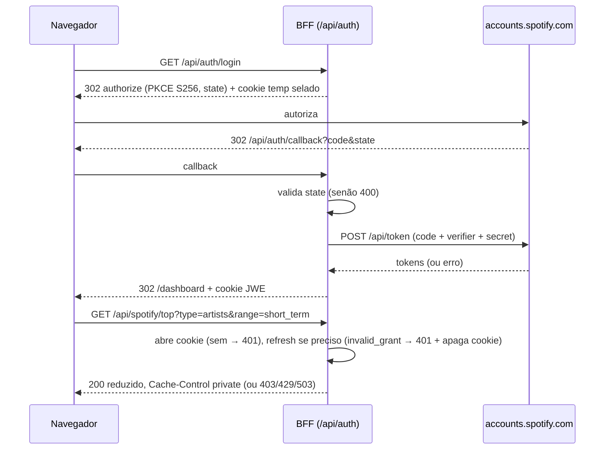

# 06 — User stories, fluxos e UAT

Papéis: **Visitante** (anônimo), **Conectado** (na allowlist do Spotify).

## Stories
**US-01. Escolher como começar.** Como visitante, quero entender em segundos as 3 formas de usar e que meus dados não saem do dispositivo, para confiar e começar. (RF-01)
- Dado que abro a landing, então vejo Upload, Conectar e Demo, além do selo de privacidade com link para o código.
- Dado que o Conectar não está configurado, então o botão aparece desabilitado com uma explicação.

**US-02. Saber como pedir meu histórico.** Como visitante, quero um passo a passo para solicitar o histórico estendido, para não travar na primeira etapa. (RF-02)
- Vejo os passos, o aviso de que pode levar até ~30 dias e os atalhos "ver demo" e "conectar".
- Posso baixar um lembrete `.ics` sem enviar nenhum dado.

**US-03. Enviar meu histórico com segurança.** Como visitante, quero arrastar o `.zip` e acompanhar o processamento, para ver minhas stats sem enviar nada a servidor. (RF-03 a RF-05, RNF-01)
- Com um `.zip` válido: progresso por etapa e, ao terminar, o dashboard.
- Posso cancelar a qualquer momento.
- Zip inválido, bomb, formato inesperado ou arquivo grande demais: mensagem clara e nada quebra.
- Durante e depois do upload, nenhuma requisição de rede leva o conteúdo.

**US-04. Ver meu resumo de qualquer período.** Como visitante com histórico carregado, quero escolher um período e ver tops e totais, para ter o "Wrapped" quando quiser. (RF-06 a RF-09)
- Ao escolher "2024", os tops e os totais mudam em < 200 ms.
- Podcasts não aparecem; um play conta a partir de 30 s (regra explicada num tooltip).

**US-05. Saber quando e onde eu ouço.** Como visitante, quero um heatmap hora × dia e a plataforma que mais uso. (RF-10)
- O heatmap tem uma tabela equivalente acessível e respeita o meu fuso.

**US-06. Comparar-me comigo mesmo.** Como visitante, quero métricas como "fã desde", "% dos plays", "dias diferentes", "mais pulada" e "dia mais musical", para substituir o "top x%" de forma honesta. (RF-11)
- Cada métrica deixa claro que é uma comparação com o meu próprio histórico.

**US-07. Experimentar sem conta.** Como recrutador ou curioso, quero um modo demo completo, para ver o produto sem arquivo nem login. (RF-12)
- O demo cobre os dashboards de upload e de conectar e gera cards; funciona sem rede após carregar.

**US-08. Conectar minha conta.** Como conectado, quero entrar com o Spotify e sair quando quiser. (RF-13, RF-14)
- Login com sucesso leva ao dashboard; o logout apaga a sessão e o cache.
- Fora da allowlist: mensagem explicando o limite de 5 usuários e sugerindo Upload ou Demo.
- Sessão expirada (`invalid_grant`): pedido de reconexão.

**US-09. Ver meu top ao vivo.** Como conectado, quero top artistas e músicas nas 3 janelas, tendências, tocadas recentemente e gêneros. (RF-15 a RF-17, RF-19, RF-22, RF-25)
- Trocar de janela usa o cache; os dados têm atribuição e o link "Abrir no Spotify".
- Com menos de 3 gêneros, a seção some sem erro.
- 429 ou quota esgotada: mensagem honesta com o tempo de espera.

**US-10. Descobrir de quem tenho mais músicas curtidas.** Como conectado, quero saber o artista com mais curtidas e quantas. (RF-18)
- Inicio a varredura, vejo o progresso (páginas lidas/total) e posso cancelar. Na segunda visita (< 12 h, sem mudanças), o resultado é imediato.

**US-11. Compartilhar um card.** Como qualquer usuário, quero gerar um card (Básico ou Festival, 9:16 ou 1:1) e compartilhar no celular. (RF-20 a RF-22)
- No celular: abrir prévia → Compartilhar → escolher o app (≤ 3 toques).
- Sem Web Share: o PNG é baixado.
- Cards com dados da API trazem a atribuição do Spotify.

**US-12. Usar no meu idioma.** Como usuário, quero alternar entre PT-BR e EN. (RF-23)

**US-13. Entender o que acontece com meus dados.** Como usuário, quero uma página de privacidade clara, com instruções para revogar o acesso. (RF-24)

## Fluxos principais
**Upload**
1. O usuário solta o `.zip` na dropzone.
2. O worker lê as entradas do zip em streaming e valida limites e nomes. Se algo falhar, mostra erro tipado e volta ao passo 1.
3. Cada `Streaming_History_Audio_*.json` passa por `JSON.parse` e validação Zod por registro, e alimenta os dicionários e as colunas. Com > 5% de registros inválidos num arquivo, mostra erro de formato.
4. O Dataset é transferido à UI (Zustand) e aparece o dashboard. Cancelar a qualquer momento aborta o worker e limpa a memória.

**Conectar**

**Card**
1. O usuário escolhe o card e o formato.
2. O app carrega satori e resvg sob demanda.
3. O PNG é gerado e fica em cache como blob, já pronto para compartilhar.
4. O botão Compartilhar chama `navigator.share` se `canShare({files})` for verdadeiro; senão faz download.

## Roteiro de UAT (com o cliente)
1. Na landing, conferir os 3 modos, o selo de privacidade e os dois idiomas.
2. Abrir o Demo, percorrer os dashboards e gerar um card Festival 9:16.
3. Seguir o onboarding e baixar o `.ics`.
4. Fazer upload do **seu histórico real**:
   - medir o tempo;
   - trocar de período (ano atual, desde sempre, intervalo);
   - conferir o heatmap e as métricas "você por você".
5. Com o DevTools aberto na aba Network, confirmar que nada foi enviado.
6. Conectar com a sua conta:
   - conferir top e tendências nas janelas;
   - rodar a varredura de curtidas;
   - checar tocadas recentemente e gêneros.
7. Conectar com uma conta fora da allowlist e verificar a mensagem.
8. No iPhone ou Android: gerar e compartilhar um card nos Stories.
9. Fazer logout e confirmar que, ao voltar, é preciso reconectar e não resta cache.
10. Ler a página de privacidade e validar o texto.
